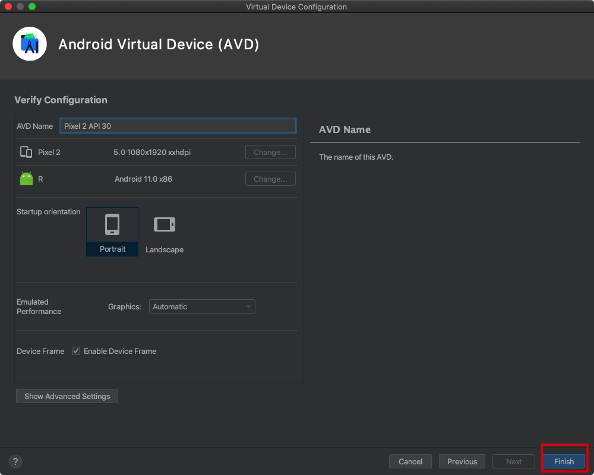

Android Kotlin Project Created by Android Studio Demo
=====================================================

由Android Studio生成的kotlin android project.

注意：目前只会通过Android Studio运行，不知道如何通过gradle命令运行

## 运行

1. 在Android Studio创建好模拟器

2. 点击运行

3. 在模拟器中看到效果

